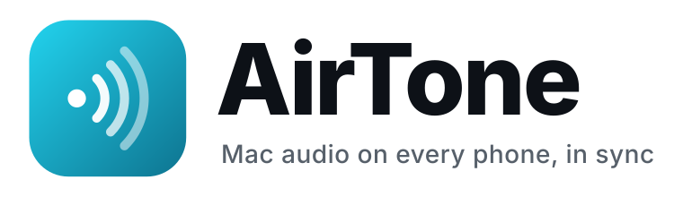
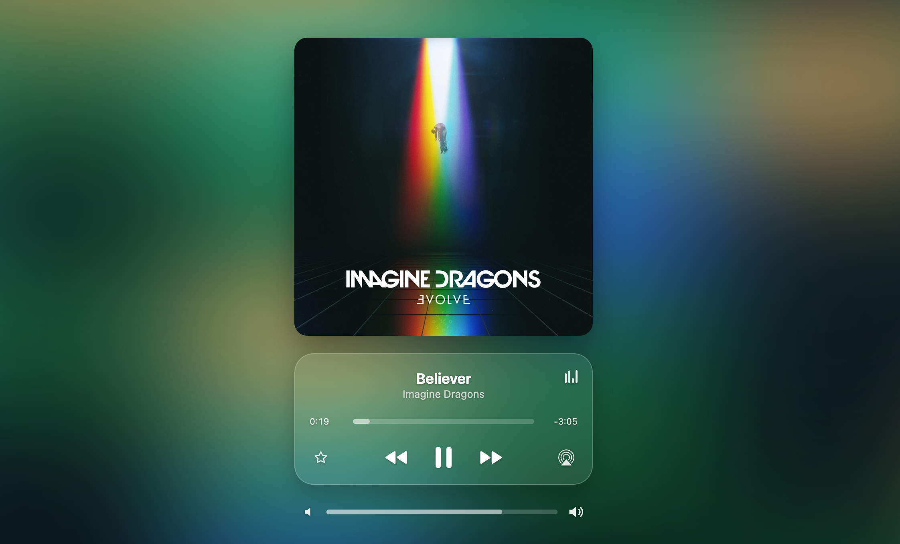
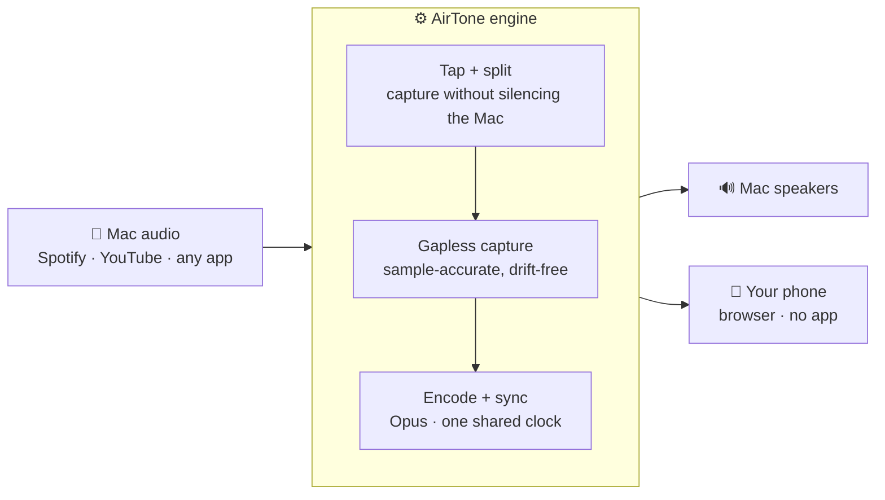

<p align="center">
  <picture>
    <source media="(prefers-color-scheme: dark)" srcset="docs/brand/airtone-wordmark-dark.svg">
    
  </picture>
</p>

<p align="center"><b>Play your Mac's sound on your phone — in sync, gapless, no app to install.</b></p>

<p align="center">One command on the Mac. One tap on the phone. Your music, around the whole house — together.</p>

<p align="center">
  <a href="https://github.com/sait-turanalp/airtone/releases"></a>
  <a href="LICENSE"></a>
  
  
  
</p>

<p align="center">
  <a href="#features">Features</a> •
  <a href="#quick-start">Quick start</a> •
  <a href="#the-phone">The phone</a> •
  <a href="#how-it-works">How it works</a> •
  <a href="#comparison">Comparison</a> •
  <a href="#license">License</a>
</p>

<p align="center">
  
</p>

AirTone is a local audio **engine** for macOS. It unifies a driver-free system-audio tap, a gapless capture stage, and a sample-accurate sync server into a single tool — so whatever plays on your Mac also plays on your phone, perfectly in sync. The phone just opens a web page (scan a QR code) — **nothing to install** — and doubles as a polished remote for your Mac's playback.

> **Why this exists.** macOS has no built-in way to send arbitrary *system* audio to a phone's browser, in sync — AirPlay only targets Apple speakers and devices, and no open-source project packaged this end to end. The hard part isn't the network; it's **timing**: a naive capture drops samples and forces the sync engine to re-lock several times a second, so the audio stutters — and when the Mac plays its own audio directly, it runs a full buffer *ahead* of the phone, so the two can never be used together. AirTone fixes both at the root: a **CoreAudio process tap** captures system audio with no virtual driver and without ever switching your output device, and the Mac joins its own stream as a client, so Mac and phone play as one pair. The full diagnostic story is in [docs/troubleshooting.md](docs/troubleshooting.md).

## Features

- 🔊 **Listen in sync** — your Mac's audio on any phone and any number of speakers, sample-accurate, all locked to one clock.
- 📱 **No app, ever** — the phone just opens a web page (scan the QR). iPhone, Android, anything with a browser.
- 🎛️ **Your phone is the remote** — a modern, **iOS-26-style "liquid glass"** web player: live album art, an artwork-derived ambient background, transport, drag-to-scrub, and volume — for *any* app, with **no permissions**.
- 🎵 **Gapless & drift-free** — the capture problem that makes naive setups stutter, solved at the source.
- ⚡ **One command** — `brew install`, a guided `setup`, and a built-in `doctor` that checks everything for you.
- 🦾 **Single Go binary** — the engine, web UI, and control helpers are embedded; the playback helper needs no permissions and works offline.

## Quick start

```bash
# 1) AirTone (also pulls snapcast)
brew install sait-turanalp/airtone/airtone

# 2) set up once, then launch
airtone setup
airtone
```

Then play audio on the Mac and **scan the QR code** with your phone. That's it.

## Usage

```text
airtone            # interactive TUI — live dashboard + QR
airtone party      # stream synced audio to phones/speakers   [alias: start]
airtone instant    # open the phone remote (now-playing + controls)
airtone status     # live status
airtone doctor     # check your setup, fix issues
airtone stop       # stop streaming and restore your output
```

## The phone

Open the page (or scan the QR) — there is nothing to install on the phone.

- **Listen** — a synced browser player. Add as many devices as you like; they all play together on a shared clock.
- **Control** — a full-screen **now-playing remote** styled like iOS-26 liquid glass: high-res album art (looked up via the iTunes catalogue), a live ambient background drawn from the cover, transport, a drag-to-scrub timeline, and a volume slider. It drives **any** media app (Spotify, Apple Music, a browser tab) through Apple's MediaRemote — **no app, no permission**, with the helper bundled so it works offline.

## How it works

AirTone is a single **engine**: it unifies a virtual sound driver, a gapless capture stage, and a sample-accurate sync server, so you install and run *one* thing — not five.



**Built on** the best open pieces — Apple's CoreAudio process taps, [Snapcast](https://github.com/badaix/snapcast), Apple's MediaRemote, and WebRTC — orchestrated into one drift-free pipeline. The part AirTone owns is the **timing**: a driver-free capture feeding a stream the Mac itself plays back, so every device stays together.

Full design notes: [ARCHITECTURE.md](ARCHITECTURE.md).

## Comparison

| | **AirTone** | AirPlay (built-in) | Snapcast (raw) |
|---|:---:|:---:|:---:|
| Mac audio → **any phone**, in the browser | ✅ | ❌ Apple devices only | ⚠️ DIY, no capture |
| No app on the phone | ✅ | ✅ *(Apple only)* | ⚠️ |
| Sample-accurate multi-room sync | ✅ | ✅ *(AirPlay 2)* | ✅ |
| Phone as a remote (now-playing · transport · volume) | ✅ | ❌ | ❌ |
| Modern, iOS-26-style web player | ✅ | — | ❌ |
| Gapless, drift-free capture out of the box | ✅ | ✅ | ⚠️ you wire it |
| One command to install + guided setup | ✅ | n/a | ❌ |
| Open source | ✅ GPL-3.0 | ❌ | ✅ GPL |

## Requirements

- macOS 14.2+ (the system-audio tap API; Apple Silicon recommended)
- Xcode Command Line Tools (`xcode-select --install`) — the tap is compiled once at setup
- `snapcast` (pulled by Homebrew); `ffmpeg` for `instant`
- A phone on the **same Wi-Fi** as the Mac

## Honest limitations

- **The phone can't be a native AirPlay receiver** — an Apple restriction; AirTone uses a local web stream instead.
- **Party mode mutes the Mac's direct output** — on purpose: the Mac plays the synced stream instead, which is the only way it can stay in step with your phone. Quitting restores it.
- **Sync means latency** — everyone plays a little behind "live," together. Tunable: lower is snappier, higher is smoother.
- **A phone browser is the loosest client** — tens of milliseconds, not the sub-millisecond a native client reaches. Fine for listening; not for lip-sync.
- **The stream is unencrypted on your LAN** — fine for home; don't expose it to untrusted networks.

## Roadmap

- Low-latency listening in the phone player (the WebRTC engine is already in place)
- Menu-bar GUI
- Multi-room presets & per-client control
- Linux / Windows server side

## Contributing

Contributions welcome — see [CONTRIBUTING.md](CONTRIBUTING.md). The reasoning behind every design choice lives in [docs/troubleshooting.md](docs/troubleshooting.md).

## License

[GPL-3.0](LICENSE) © Sait Turanalp — see [COPYRIGHT](COPYRIGHT).
Releases up to v0.3.3 were MIT; the browser player now builds on Snapcast's GPL-3.0 streaming engine.
